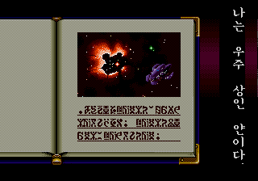
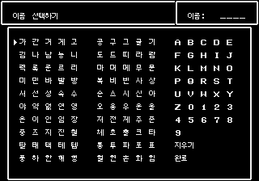
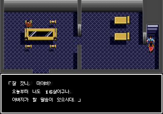

# 블루 알마낙 한국어 패치

메가드라이브(Mega Drive) 일본판 《블루 알마낙》의 비공식 한국어 패치입니다. 현재 배포 버전은 **v0.9.0**입니다.

## 다운로드

[v0.9.0 패치 다운로드](https://github.com/kilk96/blue-almanac-korean-patch/releases/tag/v0.9.0)에서 `BlueAlmanac_ko_v0.9.0.zip`을 받아 압축을 풀어 주세요. 페이지의 **Assets**(첨부 파일)에서 찾을 수 있습니다.

`Source code` 압축 파일은 받지 않으셔도 됩니다. 원본 게임 파일과 패치 적용이 끝난 게임 파일은 제공하지 않습니다.

## 적용 방법

1. 직접 보유하신 일본판 원본 ROM과 기존 세이브를 백업하고, 아래 **지원 원본과 파일 확인**의 크기·SHA-256을 확인해 주세요.
2. **xdelta 3.2 armor 호환 패처**에서 원본 ROM과 `BlueAlmanac_ko_v0.9.0.xdelta`를 선택해 주세요. armor는 원본과 결과 파일을 검사하는 형식이며, 구형 패처에서는 적용에 실패할 수 있습니다. 원본 검증 옵션을 유지해 주세요.
3. 결과를 원본과 다른 이름의 `.bin` 파일로 저장하고 아래 결과 SHA-256과 비교해 주세요. 이전 한글판을 이용하셨더라도 일본판 원본에 적용해 주세요.
4. 결과 파일을 메가드라이브 에뮬레이터에서 새로 실행해 주세요. 자세한 명령은 ZIP 안의 `README.md`에 있습니다.

## 한글판 화면

이야기의 시작과 이름 입력, 초반 대사 화면입니다. 사건 전개와 결말은 포함하지 않았습니다.







## 번역·확인 범위

- 본문 대사 690개와 주요 메뉴·아이템·전투·시스템 문구를 한글화했습니다.
- 인트로 세로 내레이션 19페이지를 한글화했습니다.
- 이름 입력은 가나다순 한글 100자, 영문 대문자와 숫자를 지원하며 최대 4글자입니다.
- 상태창 첫 표시와 캐릭터 교대 시 출력 속도를 개선했습니다.
- 기록 삭제에서 ‘예’를 선택한 뒤 ‘예/아니오’가 다른 글자로 바뀌던 문제를 수정했습니다.

엔딩까지 플레이를 확인한 뒤 인트로·이름 입력·상태창을 보완하고 해당 기능을 추가 검증했습니다. 최신 수정판 전체를 처음부터 엔딩까지 다시 플레이하지는 않았습니다.

## 실행과 저장

확인한 환경은 **BizHawk 2.11.1 / Genplus-gx**입니다. 실제 기기와 다른 에뮬레이터의 호환성은 확인하지 않았습니다.

기존 한국어 시험판의 게임 내 저장 형식은 유지했습니다. 기존 세이브를 백업하고, 버전을 바꾼 뒤에는 **새로 부팅해 게임 내 저장으로 이어 하기**를 권합니다. 세이브스테이트(에뮬레이터 순간 저장)는 실행 중 메모리까지 저장하므로 버전 간 호환에 주의해 주세요. 한국어 이름이 있는 세이브를 일본어 원본에서 열면 이름이 다르게 표시될 수 있습니다.

## 알려진 제한

- 한글 이름은 선택표의 100자만 사용할 수 있으며 공백 입력은 지원하지 않습니다.
- 상태창은 기존 한국어 시험판보다 빨라졌지만 원본 게임보다 표시가 느린 경우가 있습니다.
- 일부 드문 상황의 메시지는 실제 사용 경로가 확인되지 않아 모든 특수 메시지의 번역·표시를 검증하지 못했습니다.
- 현재 플레이 확인한 대사 배치를 유지했습니다. 줄바꿈이나 문장부호 간격에 미처 확인하지 못한 문제가 남아 있을 수 있습니다.

## 지원 원본과 파일 확인

| 항목 | 값 |
|---|---|
| 기종·판본 | Mega Drive / 일본판(J) |
| 원본 형식 | 헤더 없는 BIN |
| 원본 크기 | 1,048,576바이트 |
| 원본 SHA-256 | `F9A79BDC4F5BE9AD5D7C584980DE665F68137F97647D3CA5A983874387438BBE` |
| 결과 크기 | 2,097,152바이트 |
| 결과 SHA-256 | `74449882C0D47688D8EBBAE50FD58E865A06EBDAE0BD0CC7F1939BED05812367` |

SHA-256은 파일 내용이 같은지 확인하는 값입니다. 파일명보다 크기와 이 값이 일치하는지 확인해 주세요. SMD 형식은 지원하지 않으며 확장자만 `.bin`으로 바꾸어도 변환되지 않습니다.

Windows PowerShell에서 다음 명령의 파일명을 바꾸어 원본과 결과를 각각 확인하실 수 있습니다.

```powershell
Get-FileHash -Algorithm SHA256 -LiteralPath '확인할파일.bin'
```

패치 파일의 확인값은 ZIP 안의 `SHA256SUMS.txt`에 있습니다.

## 문제 제보

[Issues에 제보해 주세요](https://github.com/kilk96/blue-almanac-korean-patch/issues). 패치 버전, 에뮬레이터·코어 버전, 발생 장소와 직전 조작, 문제 화면과 재현 여부를 함께 적어 주세요. 원본·패치 적용 완료 ROM은 첨부하지 말아 주세요.

## 권리와 글꼴

원작사와 관계없는 팬 번역이며, 게임의 권리는 각 권리자에게 있습니다. 글꼴 출처와 이용조건은 ZIP 안의 `CREDITS.md`, `LICENSE-Dalmoori.txt`, `LICENSE-DOSMyungjo.txt`를 확인해 주세요.
